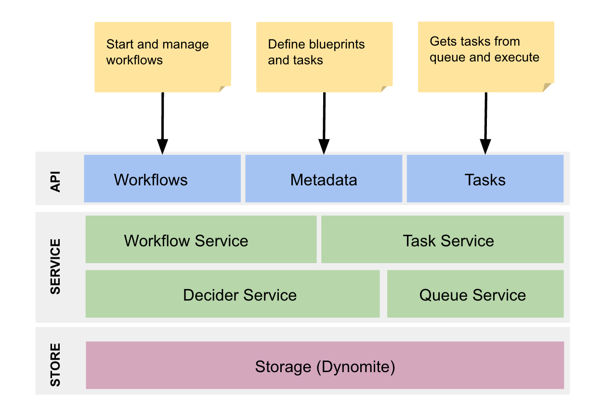

## High Level Architecture


The API and storage layers are pluggable and provide ability to work with different backends and queue service providers.

## Installing and Running

!!! hint "Running in production"
	For a detailed configuration guide on installing and running Conductor server in production visit [Conductor Server](../server) documentation.

### Running In-Memory Server

Follow the steps below to quickly bring up a local Conductor instance backed by an in-memory database with a simple kitchen sink workflow that demonstrate all the capabilities of Conductor.

!!!warning:
	In-Memory server is meant for a quick demonstration purpose and does not store the data on disk.  All the data is lost once the server dies.

#### Checkout the source from github

```
git clone git@github.com:Netflix/conductor.git
```
#### Start Local Server
```shell
cd server
../gradlew server
# wait for the server to come online
```
Swagger APIs can be accessed at [http://localhost:8080/](http://localhost:8080/)

#### Start UI Server
```shell
cd ui
gulp watch
```

#### Or Start all the services using [docker-compose](https://github.com/Netflix/conductor/blob/master/docker/docker-compose.yaml)

```shell
cd docker
docker-compose up
```

If you ran it locally, launch UI at [http://localhost:3000/](http://localhost:3000/) OR if you ran it using docker-compose launch the UI at [http://localhost:5000/](http://localhost:5000/)

!!! Note
	The server will load a sample kitchensink workflow definition by default.  See [here](/labs/kitchensink/) for details.

## Runtime Model
Conductor follows RPC based communication model where workers are running on a separate machine from the server. Workers communicate with server over HTTP based endpoints and employs polling model for managing work queues.


**Notes**

* Workers are remote systems and communicates over HTTP with the conductor servers.
* Task Queues are used to schedule tasks for workers.  We use [dyno-queues][1] internally but it can easily be swapped with SQS or similar pub-sub mechanism.
* conductor-redis-persistence module uses [Dynomite][2] for storing the state and metadata along with [Elasticsearch][3] for indexing backend.
* See section under extending backend for implementing support for different databases for storage and indexing.

[1]: https://github.com/Netflix/dyno-queues
[2]: https://github.com/Netflix/dynomite
[3]: https://www.elastic.co

## High Level Steps
**Steps required for a new workflow to be registered and get executed:**

1. Define task definitions used by the workflow.
2. Create the workflow definition
3. Create task worker(s) that polls for scheduled tasks at regular interval

**Trigger Workflow Execution**

```
POST /workflow/{name}
{
	... //json payload as workflow input
}
```

**Polling for a task**

```
GET /tasks/poll/batch/{taskType}
```
	
**Update task status**
	
```
POST /tasks
{
	"outputData": {
        "encodeResult":"success",
        "location": "http://cdn.example.com/file/location.png"
        //any task specific output
     },
     "status": "COMPLETED"
}
```
