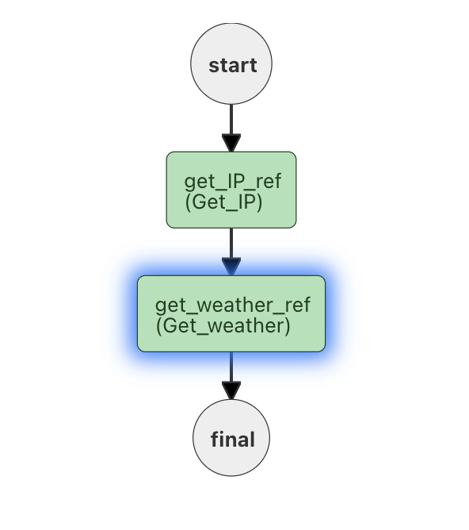

# Sequential HTTP Tasks

## Introduction

On of the primary reasons for microservice/workflow architectures is that services must run in a specific order - as downstream tasks require input from those tasks that are upstream.  In this code lab, we'll build a simple workflow with 2 HTTP tasks to demonstrate this ability.

This code lab is based on a [Stack Overflow question](https://stackoverflow.com/questions/71370237/java-design-pattern-orchestration-workflow/71385718#71385718) on the same topic.

<iframe width="560" height="315" src="https://www.youtube.com/embed/zUIWC6Cj8GQ" title="YouTube video player" frameborder="0" allow="accelerometer; autoplay; clipboard-write; encrypted-media; gyroscope; picture-in-picture" allowfullscreen></iframe>

### Why HTTP Tasks?

[HTTP Tasks](../../reference-docs/http-task) are run locally on the Conductor server, and do not require a separate worker to be run for the workflow to complete.  By using System tasks, this workflow can be completely self contained and run on any instance of Conductor with no coding at all.

## What we are building

There are 2 HTTP Tasks in our code:

* **get_IP**:  This uses the supplied IP address (from the workflow input) to get details about the IP address.
* **get_weather**: Uses the zip code provided by the get_IP output to find the current weather locations for the area the IP address is from.

The second task can only run with input provided from the first task.



## Codelab Requirements

You'll need a version of Conductor.  The images will be based on the [Conductor Playground](https://play.orkes.io), but a [local Conductor instance](../../server) works as well.

## Workflow input

The workflow is given an IP address:

```json
{
    "ipaddress": "76.179.66.17" 
}
```

## The Workflow

Here is the outline of the workflow.  At the moment, the 2 tasks are not included, but that code will appear as we discuss the tasks (and can be inserted for your testing purposes.)

The workflow is pretty basic - with a name (if using the playground, your workflow will need a unique name). and description.  There are 2 ```outputParameters``` defined - that we'll discuss further in the codelab.

```json
{
  "name": "Stack_overflow_sequential_http",
  "description": "Answering https://stackoverflow.com/questions/71370237/java-design-pattern-orchestration-workflow",
  "version": 1,
  "tasks": [
       <2 tasks will go here>
  ],
  "inputParameters": [],
  "outputParameters": {
    "zipcode": "${get_IP_ref.output.response.body.zip}",
    "forecast": "${get_weather_ref.output.response.body.currentConditions.comment}"
  },
  "schemaVersion": 2,
  "restartable": true,
  "workflowStatusListenerEnabled": false,
  "ownerEmail": "example@email.com",
  "timeoutPolicy": "ALERT_ONLY",
  "timeoutSeconds": 0,
  "variables": {},
  "inputTemplate": {}
}
```

Now, lets begin adding the two tasks to the workflow:

### get_IP

the get_IP task is a HTTP task (and since it is a System task - it only needs to be defined in the workflow):  The IP address (from the workflow input) is inserted into the URL as ```${workflow.input.ipaddress}```:

```json
{
      "name": "Get_IP",
      "taskReferenceName": "get_IP_ref",
      "inputParameters": {
        "http_request": {
          "uri": "http://ip-api.com/json/${workflow.input.ipaddress}?fields=status,message,country,countryCode,region,regionName,city,zip,lat,lon,timezone,offset,isp,org,as,query",
          "method": "GET"
        }
      },
      "type": "HTTP",
      "decisionCases": {},
      "defaultCase": [],
      "forkTasks": [],
      "startDelay": 0,
      "joinOn": [],
      "optional": false,
      "defaultExclusiveJoinTask": [],
      "asyncComplete": false,
      "loopOver": [],
      "retryCount": 3
    }
```

When this task runs, the URI is accessed as a GET request, and the output will be the response from the server.  One of the parameters of this API response is a ```zip``` that reports a zipcode related to the IP address.  In Conductor, we're able to access this value using the following term:

```${get_IP_ref.output.response.body.zip}```

We can use this as an input in the second task ```get_weather```.

### get_weather

The ```get_weather``` HTTP task is very similar to the ```get_IP``` in that it calls a 3rd party API to get results.  In this case, the API takes in a zip code *note this may make the workflow US only* and outputs the current weather conditions. We add the Zipcode reference from the ```get_IP``` output in the uri string.  There are 2 new parameters in our HTTP Task ```connectionTimeOut``` and ```readTimeOut```.  We'll discuss that in a moment.

```json
{
      "name": "Get_weather",
      "taskReferenceName": "get_weather_ref",
      "inputParameters": {
        "zip_code": "${get_IP_ref.output.response.body.zip}",
        "http_request": {
          "uri": "https://weatherdbi.herokuapp.com/data/weather/${get_IP_ref.output.response.body.zip}",
          "method": "GET",
          "connectionTimeOut": 3000,
          "readTimeOut": 3000
        }
      },
      "type": "HTTP",
      "decisionCases": {},
      "defaultCase": [],
      "forkTasks": [],
      "startDelay": 0,
      "joinOn": [],
      "optional": false,
      "defaultExclusiveJoinTask": [],
      "asyncComplete": false,
      "loopOver": []
    }

```

This API comes back with lots of weather information for the zip code.  We only want to share the zip code and the current conditions.  So we find the JSON parameter from the weather output.  This, and the Zipcode response from the first task are added to the ```outputParameters``` of the workflow:

```json
  "outputParameters": {
    "zipcode": "${get_IP_ref.output.response.body.zip}",
    "forecast": "${get_weather_ref.output.response.body.currentConditions.comment}"
  }
```

##  Slow API call

The weather API is a very slow API.  If you look at the ```http_request```, we have added 2 parameters related to timeout.  We have to override the default timeout values to allow this API to respond.  (While slow, it is also free, and also requires no API key, so - tradeoffs).

### HTTP_Task retries

The HTTP request system task does not have retry parameters built in by default, but we can extend the ```get_weather``` task to include retry parameters.  We do this by creating another task (with the same name), and adding the desired parameters:

```json
{
  "createTime": 1646667682201,
  "updateTime": 1646676973253,
  "createdBy": "",
  "updatedBy": "",
  "name": "Get_weather",
  "description": "Edit or extend this sample task. Set the task name to get started",
  "retryCount": 3,
  "timeoutSeconds": 5,
  "inputKeys": [],
  "outputKeys": [],
  "timeoutPolicy": "TIME_OUT_WF",
  "retryLogic": "FIXED",
  "retryDelaySeconds": 5,
  "responseTimeoutSeconds": 5,
  "inputTemplate": {},
  "rateLimitPerFrequency": 0,
  "rateLimitFrequencyInSeconds": 1,
  "backoffScaleFactor": 1
}
```

This tells Conductor to add a ```retryCount: 3```, with a ```"retryDelaySeconds": 5,``` between each attempt.  The retry logic is set to ```"retryLogic": "FIXED",``` (but could also be set to ```EXPONENTIAL_BACKOFF```)  ([Read more on this](../../how-tos/Tasks/extending-system-tasks)).


If the timeout is lowered in the HTTP connection (say to 1500ms), this task is much more likely to fail (due to the slow API response time).  The task will be attempted 4 times (once and then 3 retries), and if none of the attempts succeed, the workflow will fail after 4 tries.


##  Conclusion

In ths codelab, we built a simple Conductor workflow to showcase how downstream tasks can take in data from tasks that have run earlier in the workflow.

We also demonstrated how HTTP tasks work, and even extended a HTTP_Task to add retries and retry timings to ensure success of our workflow.

