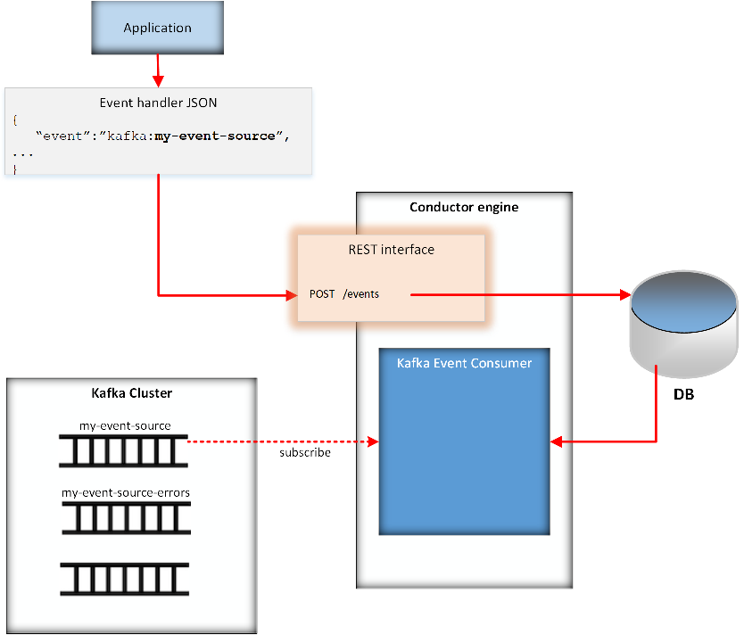

# Kafka Event Source for Conductor
The Kafka Event Source for Conductor allows users to publish events to a Kafka topic, each event requesting Conductor to perform one of three actions.
### Conductor Event Actions
* Start a workflow  
* Complete a task
* Fail a task
 
Note that one Kafka topic can only contain events for one of these actions. If you want to be able to start workflows as well as complete tasks, you must create two Kafka topics.

The Kafka Event Source is a new implementation of the Conductor Events facility. To understand more about Conductor Events, please visit this URL: [https://netflix.github.io/conductor/configuration/eventhandlers/](https://netflix.github.io/conductor/configuration/eventhandlers/)

## Steps to follow in order to use a Kafka topic as a Conductor event source
  1. [Create a Kafka topic](#creating-the-kafka-event-source-topic) that will be used for Conductor event action requests of a specific type (see [Condictor Event Actions](#conductor-event-actions))
  2. Optionally [create a Kafka 'error' topic](#creating-the-kafka-error-topic) that will be used by Conductor to publish error information if Conductor gets an error while processing the request
  3. [Create an event handler](#creating-the-event-handler) to 'handle' each request that Conductor finds in your topic

### Creating the Kafka event source topic
Working with the Kafka admins, create a topic that will be used to hold requests for Conductor to perform one of the supported event actions (see [Condictor Event Actions](#conductor-event-actions)). In addition to your service account having access to that topic, the Conductor team's service account (svc-sioetd*) must also have consumer access.

### Creating the Kafka error topic
While processing the event action request, Conductor could have an error. you won't know about it because Kafka is asynchronous. If you want to know about any errors, you would create another topic with the same name as the event source topic but with a '-errors' suffix. 
For example, if your event source topic was named my-event-source, your error topic would be named my-event-source-errors.

Working with the Kafka admins, create a topic that will be used to hold these errors. In addition to your service account having access to that topic, the Conductor team's service account (svc-sioetd*) must also have producer access.

### Creating the event handler
Conductor knows which Kafka topics to subscribe to based on the event handlers that have been added via calls to its POST /events REST API. Each event handler has an 'event' attribute. For
Kafka event handlers, the event starts with 'kafka:' and is followed with the Kafka topic name. After the POST /events API is called, and when the Conductor engine starts up and loads 
all the event handlers, the Conductor Kafka event consumer for each event handler gets the topic name from the event attribute of the handler and subscribes to that topic.

The image below depicts this process.



When an event is published to that topic, the Kafka event consumer uses the event handler body to figure out what needs to be done and performs the action.

If in the processing of the event there is an exception, the Kafka event consumer can do the following:
1. If there is an attribute in the event body named 'errorNotificationEmail' that contains one or more comma-delimited email addresses, those email addresses will be sent an email that describes the error
2. If there exists a Kafka topic with a topic name of the event source topic name suffixed with '-errors', the error information will be published to that topic by the Kafka event consumer

## Example event handlers
The following examples cover the different events that you can publish to a topic and the event handlers that might be used to process them.
### Starting a workflow
An example of an event that could be published to the start-my-workflow topic:
```text

{
  "customerId": "12345",
  "startTheWorkflow": true
}

```
An example of an event handler that would cause Conductor to subscribe to the start-my-workflow topic and process the events that are published to that topic:
```text

{
    "name": "start_my_workflow",
    "event": "kafka:start-my-workflow",
    "condition": "$.startTheWorkflow",
    "actions": [
      {
        "action": "start_workflow",
        "start_workflow": {
          "name": "MY_WORKFLOW_WF",
          "input": {
            "customerId": "${customerId}"
          }
        }
      }
    ],
    "active": true
  }

```
As you can see, the 'event' attribute specifies that it is a 'kafka' event handler and the topic that should be subscribed to is start-my-workflow. The action that Conductor should perform
when it finds a message on the topic is 'start_workflow' and the instructions for how it should perform that action are in the 'start_workflow' JSON structure. In that structure,
it identifies that the workflow type is MY_WORKFLOW_WF and it specifies the input to that workflow.

The 'condition' attribute is a boolean that allows the event to dictate whether or not to start the workflow. The $. syntax means to take the value from the 'startTheWorkflow' attribute
found in the event body. The ${customerId} syntax means to get the value from the input. Note the difference in the syntax between variables for the 'condition' attribute value and
any variables found in the workflow input.

Note that if every event was going to start the workflow and that did not need to be controlled by a variable, you could just set the 'condition' attribute value to true, e.g.
```text

{
    "name": "start_my_workflow",
    "event": "kafka:start-my-workflow",
    "condition": true,
    "actions": [
      {
        "action": "start_workflow",
        "start_workflow": {
          "name": "MY_WORKFLOW_WF",
          "input": {
            "customerId": "${customerId}"
          }
        }
      }
    ],
    "active": true
  }

```
In this case, you could leave out the 'startTheWorkflow' attribute in the event.

You can also use an expression that evaluates to a boolean, for example, you could have an event like this:
```text

{
  "customerId": "12345",
  "customerType": "a-good-customer"
}

```
and an event handler like this:
```text

{
    "name": "start_my_workflow",
    "event": "kafka:start-my-workflow",
    "condition": "$.customerType == 'a-good-customer'",
    "actions": [
      {
        "action": "start_workflow",
        "start_workflow": {
          "name": "MY_WORKFLOW_WF",
          "input": {
            "customerId": "${customerId}"
          }
        }
      }
    ],
    "active": true
  }

```

### Completing a task
When a WAIT task is in one of your workflows, there are several ways that WAIT task can be completed. One way is to use an event. For completing such a task, an example of an event that could be published to the complete-my-wait-task topic:
```text

{
  "workflowIdOfWaitTask": "e427a2bf-4279-4730-a80c-4919516280dd",
  "completeIt": true
}

```
An example of an event handler that would cause Conductor to subscribe to the complete-my-wait-task topic and process the events that are published to that topic:
```text

{
    "name" : "complete_wait_task",
    "event": "kafka:complete-my-wait-task",
    "condition": "$.completeIt",
    "actions": [{
        "action": "complete_task",
        "complete_task": {
         "workflowId": "${workflowIdOfWaitTask}",
         "taskRefName": "myWaitTask"
        }
     }],
     "active": true
}

```
In this case, the event would contain an attribute named 'completeIt' with a value that is a boolean and that would control if the task would be completed. If there is no need
to conditionally control whether the task is to be completed, the 'condition' could be set to true and there would be no need for the event to contain a 'completeIt' attribute.

The 'workflowId' attribute contains the id of the workflow containing the task to be completed and the taskRefName specifies the task reference name of the task within the
workflow.

### Failing a task
When a WAIT task is in one of your workflows, there are several ways that WAIT task can be completed. One way is to use an event. For completing such a task, an example of an event that could be published to the fail-my-wait-task topic:
```text

{
  "workflowIdOfWaitTask": "e427a2bf-4279-4730-a80c-4919516280dd",
  "failIt": true
}

```
An example of an event handler that would cause Conductor to subscribe to the fail-my-wait-task topic and process the events that are published to that topic:
```text

{
    "name" : "fail_wait_task",
    "event": "kafka:fail-my-wait-task",
    "condition": "$.failIt",
    "actions": [{
        "action": "fail_task",
        "fail_task": {
         "workflowId": "${workflowIdOfWaitTask}",
         "taskRefName": "myWaitTask"
        }
     }],
     "active": true
}

```
In this case, the event would contain an attribute named 'failIt' with a value that is a boolean and that would control if the task would be failed. If there is no need
to conditionally control whether the task is to be failed, the 'condition' could be set to true and there would be no need for the event to contain a 'failIt' attribute.

The 'workflowId' attribute contains the id of the workflow containing the task to be failed and the taskRefName specifies the task reference name of the task within the
workflow.


### Specifying an email address that will receive notifications of event failures
If you want someone to be notified when one of the events is not executed because of a failure for any reason, specify the 'errorNotificationEmail' attribute in the event JSON, like so:
```text

{
  "workflowIdOfWaitTask": "e427a2bf-4279-4730-a80c-4919516280dd",
  "completeIt": true,
  "errorNotificationEmail": "teamAdmins@bcbsfl.com"
}

```

This attribute can be added to any event.

### Documents published to the errors topic
If you create a Kafka topic with a name of the event source topic concatenated with '-errors', Conductor will publish any errors that happen while processing events to that
topic. An example document that would go to this topic is shown below.
```text

{
  "message": {
    "payload": {
      "workflowIdOfWaitTask": "e427a2bf-4279-4730-a80c-4919516280dd",
      "completed": true,
      "errorNotificationEmail": "testAdmins@bcbsfl.com"
    },
    "id": "null:complete-my-wait-task:0:88",
    "receipt": "",
    "priority": 0
  },
  "eventExecution": {
    "id": "null:complete-my-wait-task:0:88_0",
    "messageId": "null:complete-my-wait-task:0:88",
    "name": "complete_wait_task",
    "event": "kafka:complete-my-wait-task",
    "created": 1593555406976,
    "status": "FAILED",
    "action": "complete_task",
    "output": {
      "exception": "Operation 'executeEventAction:Executing action: complete_task for event: null:complete-my-wait-task:0:88_0 with messageId: null:complete-my-wait-task:0:88 with payload: {workflowIdOfWaitTask=e427a2bf-4279-4730-a80c-4919516280dd, completed=true, errorNotificationEmail=testAdminsn@bcbsfl.com}' failed for the 1 time in RetryUtil",
      "exceptionCause": "No such workflow found by id: e427a2bf-4279-4730-a80c-4919516280dd"
    }
  }
}

```

The 'message' attribute contains the event. The payload part of that is actually what was found in the event topic. The 'eventExecution' attribute contains information about what
happened executing that event, with exception information in the 'output' attribute.

You can have a Kafka consumer application that subscribes to that errors topic if you want to automatically process the errors. Either way, it is a good idea to specify an
'errorNotificationEmail' attribute in your events so that someone will be notified of the failures.

## Conductor properties for the Kafka event source
There are several properties that need to be set in the Conductor server properties file to use the Kafka event source.
### conductor.additional.modules
The first thing you need to do to allow the Kafka event source to be initialized and available is to add it as an 'additional module':
```text
conductor.additional.modules=com.netflix.conductor.contribs.KafkaModule
```
### General Kafka properties vs event-specific Kafka properties
Since there is now more than one Kafka component in Conductor (Kafka Publish task and this event source) and some Kafka properties will apply to both, we have to be conscious of that and not duplicate properties that apply to all the Kafka components. Therefore there are 'default' property names that, if used, will apply to all Kafka components and 'event' properties that apply to just the Kafka event source component. If both are specified in the server properties, the 'event' property will override the 'default' property.
### General Kafka properties
|field|description|Notes|
|---|---|---|
|kafka.default.bootstrap.servers|A comma-delimited list of Kafka servers that will apply to all Kafka components|These are the servers in the Kafka cluster|
|kafka.default.consumer.group.id|The consumer group id that will be used to consume from the Kafka topics associated with all queues||
|kafka.default.jaas.config.file|The JAAS configuration file that defines security associated with the Kafka topics|optional - only needed if there is security associated with the topics|
|kafka.default.jaas.username|The username to use if the JAAS configuration file specifies to use the com.netflix.conductor.contribs.kafka.KafkaLoginModule|This is the username that has access to the topics|
|kafka.default.jaas.passwrd|The password to use if the JAAS configuration file specifies to use the com.netflix.conductor.contribs.kafka.KafkaLoginModule|This is the password for the username specified in the kafka.default.jaas.username property|
|kafka.default.bootstrap.servers|A comma-delimited list of Kafka servers that will apply to all Kafka components|These are the servers in the Kafka cluster|
### Event Kafka properties
|field|description|Notes|
|---|---|---|
|name|Task Type. Unique name of the Task that resonates with it's function.|Unique|
