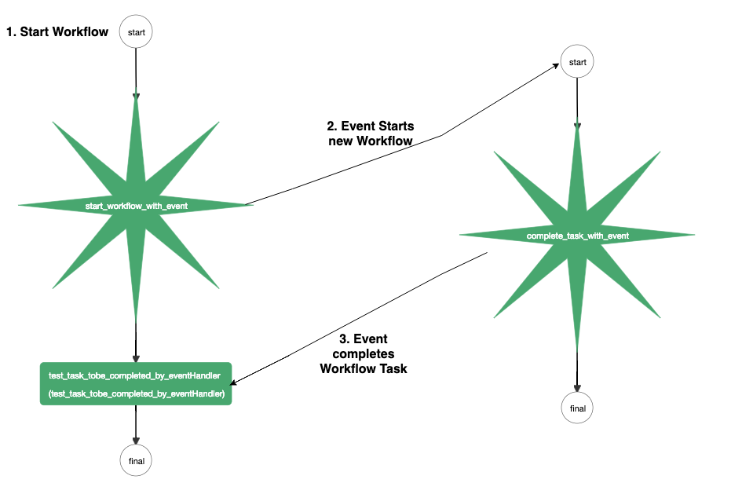

# Events and Event Handlers
## About

In this Lab, we shall:

* Publish an Event to Conductor using `Event` task.
* Subscribe to Events, and perform actions:
    * Start a Workflow
    * Complete Task

Conductor Supports Eventing with two Interfaces:

* [Event Task](/configuration/systask.html#event)
* [Event Handlers](/configuration/eventhandlers.html#event-handler)

We shall create a simple cyclic workflow similar to this:



## Create Workflow Definitions

Let's create two workflows:

* `test_workflow_for_eventHandler` which will have an `Event` task to start another workflow, and a `WAIT` System task that will be completed by an event.
* `test_workflow_startedBy_eventHandler` which will have an `Event` task to generate an event to complete `WAIT` task in the above workflow.

Send `POST` requests to `/metadata/workflow` endpoint with below payloads:

```json
{
  "name": "test_workflow_for_eventHandler",
  "description": "A test workflow to start another workflow with EventHandler",
  "version": 1,
  "tasks": [
    {
      "name": "test_start_workflow_event",
      "taskReferenceName": "start_workflow_with_event",
      "type": "EVENT",
      "sink": "conductor"
    },
    {
      "name": "test_task_tobe_completed_by_eventHandler",
      "taskReferenceName": "test_task_tobe_completed_by_eventHandler",
      "type": "WAIT"
    }
  ]
}
```

```json
{
  "name": "test_workflow_startedBy_eventHandler",
  "description": "A test workflow which is started by EventHandler, and then goes on to complete task in another workflow.",
  "version": 1,
  "tasks": [
    {
      "name": "test_complete_task_event",
      "taskReferenceName": "complete_task_with_event",
      "inputParameters": {
        "sourceWorkflowId": "${workflow.input.sourceWorkflowId}"
      },
      "type": "EVENT",
      "sink": "conductor"
    }
  ]
}
```

### Event Tasks in Workflow

`EVENT` task is a System task, and we shall define it just like other Tasks in Workflow, with `sink` parameter. Also, `EVENT` task doesn't have to be registered before using in Workflow. This is also true for the `WAIT` task.  
Hence, we will not be registering any tasks for these workflows.

## Events are sent, but they're not handled (yet)

Once you try to start `test_workflow_for_eventHandler` workflow, you would notice that the event is sent successfully, but the second worflow `test_workflow_startedBy_eventHandler` is not started. We have sent the Events, but we also need to define `Event Handlers` for Conductor to take any `actions` based on the Event. Let's create `Event Handlers`.

## Create Event Handlers

Event Handler definitions are pretty much like Task or Workflow definitions. We start by name:

```json
{
  "name": "test_start_workflow"
}
```

Event Handler should know the Queue it has to listen to. This should be defined in `event` parameter.

When using Conductor queues, define `event` with format: 

```conductor:{workflow_name}:{taskReferenceName}```

And when using SQS, define with format: 

```sqs:{my_sqs_queue_name}```

```json
{
  "name": "test_start_workflow",
  "event": "conductor:test_workflow_for_eventHandler:start_workflow_with_event"
}
```

Event Handler can perform a list of actions defined in `actions` array parameter, for this particular `event` queue.

```json
{
  "name": "test_start_workflow",
  "event": "conductor:test_workflow_for_eventHandler:start_workflow_with_event",
  "actions": [
      "<insert-actions-here>"
  ],
  "active": true
}
```

Let's define `start_workflow` action. We shall pass the name of workflow we would like to start. The `start_workflow` parameter can use any of the values from the general [Start Workflow Request](/gettingstarted/startworkflow.html). Here we are passing in the workflowId, so that the Complete Task Event Handler can use it.

```json
{
    "action": "start_workflow",
    "start_workflow": {
        "name": "test_workflow_startedBy_eventHandler",
        "input": {
            "sourceWorkflowId": "${workflowInstanceId}"
        }
    }
}
```

Send a `POST` request to `/event` endpoint:

```json
{
  "name": "test_start_workflow",
  "event": "conductor:test_workflow_for_eventHandler:start_workflow_with_event",
  "actions": [
    {
      "action": "start_workflow",
      "start_workflow": {
        "name": "test_workflow_startedBy_eventHandler",
        "input": {
          "sourceWorkflowId": "${workflowInstanceId}"
        }
      }
    }
  ],
  "active": true
}
```

Similarly, create another Event Handler to complete task.

```json
{
  "name": "test_complete_task_event",
  "event": "conductor:test_workflow_startedBy_eventHandler:complete_task_with_event",
  "actions": [
    {
    	"action": "complete_task",
    	"complete_task": {
	        "workflowId": "${sourceWorkflowId}",
	        "taskRefName": "test_task_tobe_completed_by_eventHandler"
	     }
    }
  ],
  "active": true
}
```

## Final flow of Workflow

After wiring all of the above, starting the `test_workflow_for_eventHandler` should:

1. Start `test_workflow_startedBy_eventHandler` workflow.
2. Sets `test_task_tobe_completed_by_eventHandler` WAIT task `IN_PROGRESS`.
3. `test_workflow_startedBy_eventHandler` event task would publish an Event to complete the WAIT task above.
4. Both the workflows would move to `COMPLETED` state.
