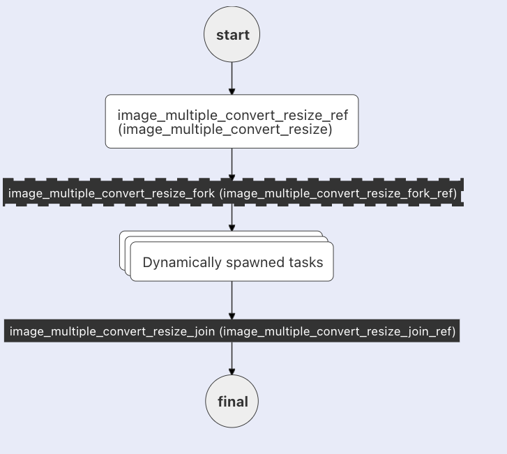

# Dynamic Fork
```json
"type" : "FORK_JOIN_DYNAMIC"
```

## Introduction

Dynamic Forks are an extension of the [Fork](../fork-task) operation in conductor.

In a regular fork operation (`FORK_JOIN` task), the size of the fork is defined at the time of workflow definition. 

For dynamic forks the list of tasks is provided at runtime using the task's input.

There are four things that are needed to configure a `FORK_JOIN_DYNAMIC` task:

1. A list of tasks or sub-workflows that needs to be forked and run in parallel.
2. A list of inputs to each of these forked tasks or sub-workflows
3. A task prior to the `FORK_JOIN_DYNAMIC` tasks outputs 1 and 2 above that can be wired in as in input to the `FORK_JOIN_DYNAMIC` tasks.
4. A ```join``` task to accept the results of the dynamic forks.  This join will wait for ALL the forked branches to complete before completing. 

## Use Cases

A `FORK_JOIN_DYNAMIC` is useful when a set of tasks or sub-workflows need to be executed and the number of tasks or
sub-workflows are determined at run time. 

> Note: Unlike ```FORK```, which can execute parallel flows with each fork executing a series of tasks in sequence, ```FORK_JOIN_DYNAMIC``` is limited to only one task per fork. However, forked task can be a Sub Workflow, allowing for more complex execution flows.

## Configuration
### Input Configuration

| Attribute      | Description |
| ----------- | ----------- |
| name      | Task Name. A unique name that is descriptive of the task function      |
| taskReferenceName   | Task Reference Name. A unique reference to this task. There can be multiple references of a task within the same workflow definition        |
| type   | `FORK_JOIN_DYNAMIC`        |
| inputParameters   | The input parameters that will be supplied to this task.         |
| dynamicForkTasksParam | This is a JSON array of tasks or sub-workflow objects that needs to be forked and run in parallel |
| dynamicForkTasksInputParamName | A JSON map, where the keys are task or sub-workflow names, and the values are its corresponding inputParameters | 

### Example

Let's say we have a task that resizes an image, and we need to create a
workflow that will resize an image into multiple sizes. In this case, a task can be created prior to
the `FORK_JOIN_DYNAMIC` task that will prepare the input that needs to be passed into the `FORK_JOIN_DYNAMIC` task. These will be:

* ```dynamicForkTasksParam``` the JSON array of tasks/subworkflows to be run in parallel.
* ```dynamicForkTasksInputParamName``` a JSON map of input parameters for each task. The keys will be the tasks/subworkflows, and the values will be the input parameters for the tasks.

The
single image resize task does one job. The `FORK_JOIN_DYNAMIC` and the following `JOIN` will manage the multiple
invokes of the single image resize task. Here, the responsibilities are clearly broken out, where the single image resize
task does the core job and `FORK_JOIN_DYNAMIC` manages the orchestration and fault tolerance aspects.

### The workflow

Here is an example of a `FORK_JOIN_DYNAMIC` task followed by a `JOIN` task:

```json
{
  "inputParameters": {
    "dynamicTasks": "${fooBarTask.output.dynamicTasksJSON}",
    "dynamicTasksInput": "${fooBarTask.output.dynamicTasksInputJSON}"
  },
  "type": "FORK_JOIN_DYNAMIC",
  "dynamicForkTasksParam": "dynamicTasks",
  "dynamicForkTasksInputParamName": "dynamicTasksInput"
},
{
"name": "image_multiple_convert_resize_join",
"taskReferenceName": "image_multiple_convert_resize_join_ref",
"type": "JOIN"
}
```

This appears in the UI as follows:



Let's assume this data is sent to the workflow:

```
{
	"fileLocation": "https://pbs.twimg.com/media/FJY7ud0XEAYVCS8?format=png&name=900x900",
	"outputFormats": ["png","jpg"],
	
	"outputSizes": [
		{"width":300,
		"height":300},
		{"width":200,
		"height":200}
		
	
	],
	"maintainAspectRatio": "true"
	
}
```

With 2 file formats and 2 sizes in the input, we'll be creating 4 images total.  The first task will generate the tasks and the parameters for these tasks:

* `dynamicForkTasksParam` This is a JSON array of task or sub-workflow objects that specifies the list of tasks or
sub-workflows that needs to be forked and run in parallel. This will have the form:

```
{ "dynamicTasks": [
  0: {
    "name": :"image_convert_resize",
    "taskReferenceName": "image_convert_resize_png_300x300_0",
    ...
  },
  1: {
    "name": :"image_convert_resize",
    "taskReferenceName": "image_convert_resize_png_200x200_1",
    ...
  },
  2: {
    "name": :"image_convert_resize",
    "taskReferenceName": "image_convert_resize_jpg_300x300_2",
    ...
  },
    3: {
    "name": :"image_convert_resize",
    "taskReferenceName": "image_convert_resize_jpg_200x200_3",
    ...
  }
]}
```

* `dynamicForkTasksInputParamName` This is a JSON map of task or
sub-workflow objects and all of the input parameters that these tasks will need to run.

```
"dynamicTasksInput":{
"image_convert_resize_jpg_300x300_2":{
"outputWidth":300
"outputHeight":300
"fileLocation":"https://pbs.twimg.com/media/FJY7ud0XEAYVCS8?format=png&name=900x900"
"outputFormat":"jpg"
"maintainAspectRatio":true
}
"image_convert_resize_jpg_200x200_3":{
"outputWidth":200
"outputHeight":200
"fileLocation":"https://pbs.twimg.com/media/FJY7ud0XEAYVCS8?format=png&name=900x900"
"outputFormat":"jpg"
"maintainAspectRatio":true
}
"image_convert_resize_png_200x200_1":{
"outputWidth":200
"outputHeight":200
"fileLocation":"https://pbs.twimg.com/media/FJY7ud0XEAYVCS8?format=png&name=900x900"
"outputFormat":"png"
"maintainAspectRatio":true
}
"image_convert_resize_png_300x300_0":{
"outputWidth":300
"outputHeight":300
"fileLocation":"https://pbs.twimg.com/media/FJY7ud0XEAYVCS8?format=png&name=900x900"
"outputFormat":"png"
"maintainAspectRatio":true
}
```

### The Join

The [JOIN](../../reference-docs/join-task) task will run after all of the dynamic tasks, collecting the output for all of the tasks.

