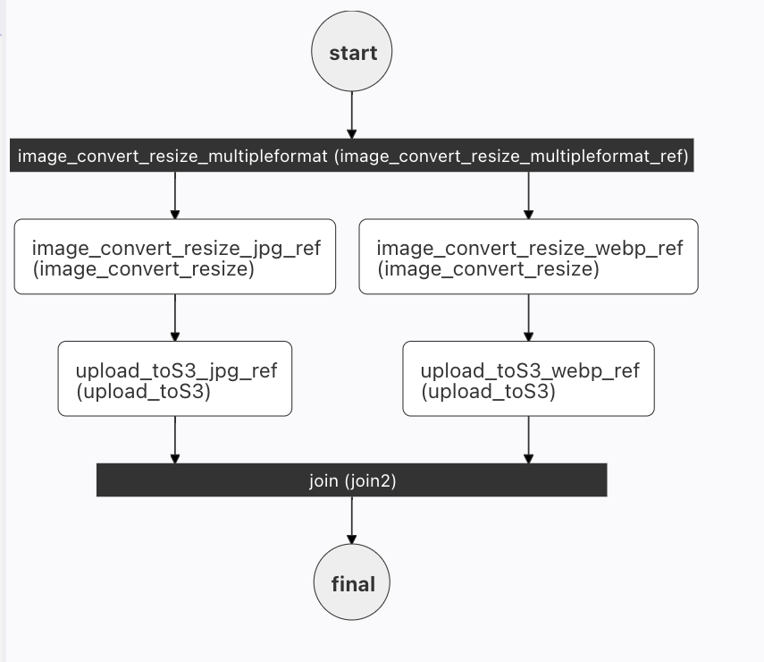
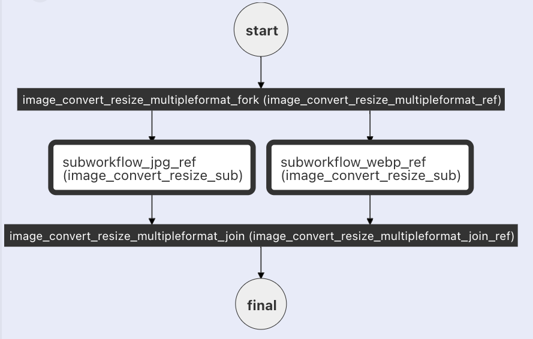

# Sub Workflow
```json
"type" : "SUB_WORKFLOW"
```
### Introduction
Sub Workflow task allows for nesting a workflow within another workflow.

### Use Cases

Suppose we want to include another workflow inside our current workflow. In that
case, Sub Workflow Task would be used.

### Configuration

Sub Workflow task is defined directly inside the workflow with `"SUB_WORKFLOW"`.

#### Inputs

**Parameters:**

|name|type|description|
|---|---|---|
| subWorkflowParam | Map[String, Any] | See below |

**subWorkflowParam**

|name|type|description|
|---|---|---|
| name | String | Name of the workflow to execute |
| version | Integer | Version of the workflow to execute |
| taskToDomain | Map[String, String] | Allows scheduling the sub workflow's tasks per given mappings. See [Task Domains](conductor/configuration/taskdomains/) for instructions to configure taskDomains. |
| workflowDefinition | [WorkflowDefinition](conductor/configuration/workflowdef/) | Allows starting a subworkflow with a dynamic workflow definition. |

#### Output

|name|type|description|
|---|---|---|
| subWorkflowId | String | Subworkflow execution Id generated when running the subworkflow |


### Examples


Imagine we have a workflow that has a fork in it.. In the example below, we inputting one image, but using a fork to create 2 images simultaneously:



The left fork will create a JPG, and the right fork a WEBP image. Maintaining this workflow might be difficult, as changes made to one side of the fork do not automatically propagate the other.  Rather than using 2 tasks, we can define a ```image_convert_resize``` workflow that we can call for both forks as a subworkflow:

```json

{{
	"name": "image_convert_resize_subworkflow1",
	"description": "Image Processing Workflow",
	"version": 1,
	"tasks": [{
			"name": "image_convert_resize_multipleformat_fork",
			"taskReferenceName": "image_convert_resize_multipleformat_ref",
			"inputParameters": {},
			"type": "FORK_JOIN",
			"decisionCases": {},
			"defaultCase": [],
			"forkTasks": [
				[{
					"name": "image_convert_resize_sub",
					"taskReferenceName": "subworkflow_jpg_ref",
					"inputParameters": {
						"fileLocation": "${workflow.input.fileLocation}",
						"recipeParameters": {
							"outputSize": {
								"width": "${workflow.input.recipeParameters.outputSize.width}",
								"height": "${workflow.input.recipeParameters.outputSize.height}"
							},
							"outputFormat": "jpg"
						}
					},
					"type": "SUB_WORKFLOW",
					"subWorkflowParam": {
						"name": "image_convert_resize",
						"version": 1
					}
				}],
				[{
						"name": "image_convert_resize_sub",
						"taskReferenceName": "subworkflow_webp_ref",
						"inputParameters": {
							"fileLocation": "${workflow.input.fileLocation}",
							"recipeParameters": {
								"outputSize": {
									"width": "${workflow.input.recipeParameters.outputSize.width}",
									"height": "${workflow.input.recipeParameters.outputSize.height}"
								},
								"outputFormat": "webp"
							}
						},
						"type": "SUB_WORKFLOW",
						"subWorkflowParam": {
							"name": "image_convert_resize",
							"version": 1
						}
					}

				]
			]
		},
		{
			"name": "image_convert_resize_multipleformat_join",
			"taskReferenceName": "image_convert_resize_multipleformat_join_ref",
			"inputParameters": {},
			"type": "JOIN",
			"decisionCases": {},
			"defaultCase": [],
			"forkTasks": [],
			"startDelay": 0,
			"joinOn": [
				"subworkflow_jpg_ref",
				"upload_toS3_webp_ref"
			],
			"optional": false,
			"defaultExclusiveJoinTask": [],
			"asyncComplete": false,
			"loopOver": []
		}
	],
	"inputParameters": [],
	"outputParameters": {
		"fileLocationJpg": "${subworkflow_jpg_ref.output.fileLocation}",
		"fileLocationWebp": "${subworkflow_webp_ref.output.fileLocation}"
	},
	"schemaVersion": 2,
	"restartable": true,
	"workflowStatusListenerEnabled": true,
	"ownerEmail": "devrel@orkes.io",
	"timeoutPolicy": "ALERT_ONLY",
	"timeoutSeconds": 0,
	"variables": {},
	"inputTemplate": {}
}
```

Now our diagram will appear as:



The inputs to both sides of the workflow are identical before and after - but we've abstracted the tasks into the subworkflow.  nay change to the subworkflow will automatically occur in bth sides of the fork.

Looking at the subworkflow (the WEBP version):

```
{
                        "name": "image_convert_resize_sub",
                        "taskReferenceName": "subworkflow_webp_ref",
                        "inputParameters": {
                            "fileLocation": "${workflow.input.fileLocation}",
                            "recipeParameters": {
                                "outputSize": {
                                    "width": "${workflow.input.recipeParameters.outputSize.width}",
                                    "height": "${workflow.input.recipeParameters.outputSize.height}"
                                },
                                "outputFormat": "webp"
                            }
                        },
                        "type": "SUB_WORKFLOW",
                        "subWorkflowParam": {
                            "name": "image_convert_resize",
                            "version": 1
                        }
                    }
```

The ```subWorkflowParam``` tells conductor which workflow to call. The task is marked as completed upon the completion of the spawned workflow. 
If the sub-workflow is terminated or fails the task is marked as failure and retried if configured. 