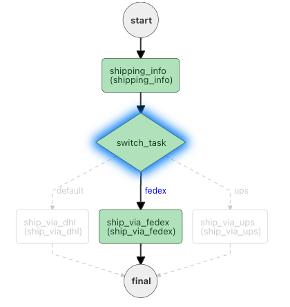

# Switch

```json
"type" : "SWITCH"
```
### Introduction
A switch task is similar to `case...switch` statement in a programming language. The `switch` expression, is
a configuration on the `SWITCH` task type. Currently, two evaluators are supported:

### Configuration

Following are the task configuration parameters :

|name|type|description|
|---|---|---|
|evaluatorType|String|[evaluatortType values](#evaluator-types)|
|expression|String|Depends on the [evaluatortType value](#evaluator-types)|
|decisionCases|Map[String, List[task]]|Map where key is possible values that can result from `expression` being evaluated by `evaluatorType` with value being list of tasks to be executed.|
|defaultCase|List[task]|List of tasks to be executed when no matching value if found in decision case (default condition)|


#### Evaluator Types
|name|description| expression|
|---|---|---|
| value-param | Use a parameter directly as the value | input parameter|
| javascript | Evaluate JavaScript expressions and compute value | JavaScript expression |

### Use Cases

Useful in any situation where we have to execute one of many task options.


### Output

Following is/are output generated by the `Switch` Task.

|name|type|description|
|---|---|---|
|evaluationResult|List[String]|A List of string representing the list of cases that matched.|


### Examples

In this example workflow, we have to ship a package with the shipping service providers on the basis of input provided
while running the workflow.

Let's create a Workflow with the following switch task definition that uses `value-param` evaluatorType:

```json
{
  "name": "switch_task",
  "taskReferenceName": "switch_task",
  "inputParameters": {
    "switchCaseValue": "${workflow.input.service}"
  },
  "type": "SWITCH",
  "evaluatorType": "value-param",
  "expression": "switchCaseValue",
  "defaultCase": [
    {
      ...
    }
  ],
  "decisionCases": {
    "fedex": [
      {
        ...
      }
    ],
    "ups": [
      {
        ...
      }
    ]
  }
}
```

In the definition above the value of the parameter `switch_case_value`
is used to determine the switch-case. The evaluator type is `value-param` and the expression is a direct reference to
the name of an input parameter. If the value of `switch_case_value` is `fedex` then the decision case `ship_via_fedex`is
executed as shown below.



In a similar way - if the input was `ups`, then `ship_via_ups` will be executed. If none of the cases match then the
default option is executed.

Here is an example using the `javascript` evaluator type:

```json
{
  "name": "switch_task",
  "taskReferenceName": "switch_task",
  "inputParameters": {
    "inputValue": "${workflow.input.service}"
  },
  "type": "SWITCH",
  "evaluatorType": "javascript",
  "expression": "$.inputValue == 'fedex' ? 'fedex' : 'ups'",
  "defaultCase": [
    {
      ...
    }
  ],
  "decisionCases": {
    "fedex": [
      {
        ...
      }
    ],
    "ups": [
      {
        ...
      }
    ]
  }
}
```
