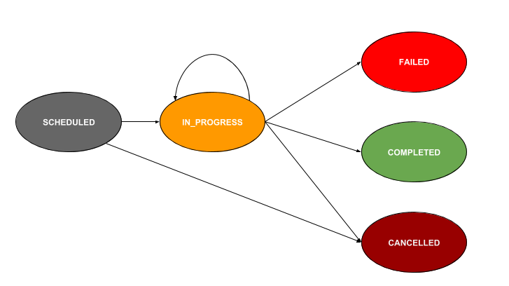
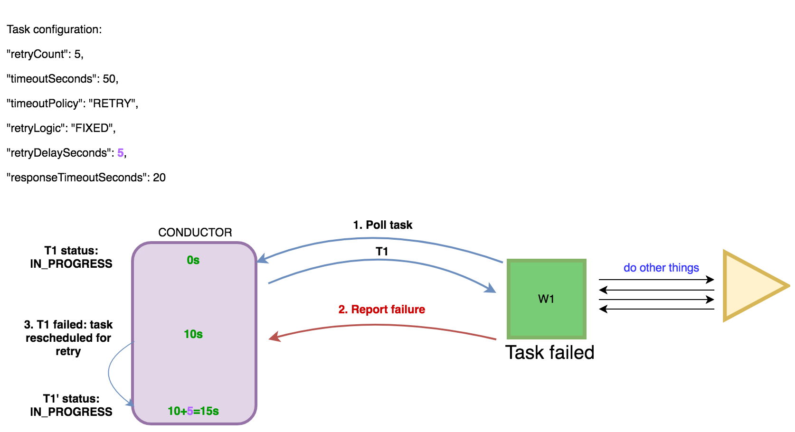
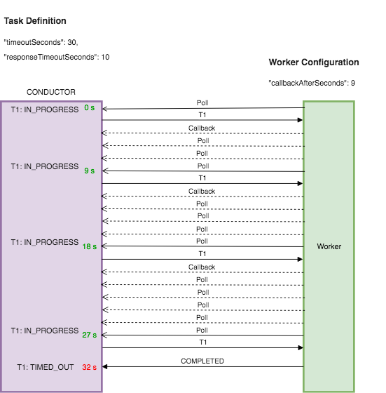
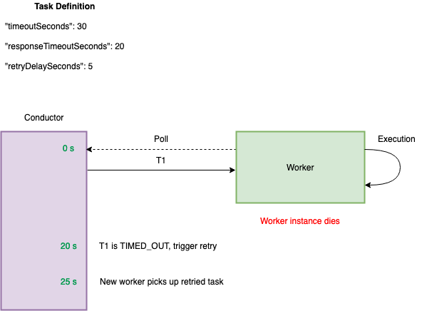

## Task state transitions
The figure below depicts the state transitions that a task can go through within a workflow execution.

## Retries and Failure Scenarios

### Task failure and retries
Retries for failed task executions of each task can be configured independently. retryCount, retryDelaySeconds and retryLogic can be used to configure the retry mechanism.

1. Worker (W1) polls for task T1 from the Conductor server and receives the task.
2. Upon processing this task, the worker determines that the task execution is a failure and reports this to the server with FAILED status after 10 seconds.
3. The server will persist this FAILED execution of T1. A new execution of task T1 will be created and scheduled to be polled. This task will be available to be polled after 5 (retryDelaySeconds) seconds.

### Timeout seconds
Timeout is the maximum amount of time that the task must reach a terminal state in, else the task will be marked as TIMED_OUT.

**0 seconds** -> Worker polls for task T1 fom the Conductor server and receives the task. T1 is put into IN_PROGRESS status by the server.  
Worker starts processing the task but is unable to process the task at this time. Worker updates the server with T1 set to IN_PROGRESS status and a callback of 9 seconds.  
Server puts T1 back in the queue but makes it invisible and the worker continues to poll for the task but does not receive T1 for 9 seconds.  

**9,18 seconds** -> Worker receives T1 from the server and is still unable to process the task and updates the server with a callback of 9 seconds.

**27 seconds** -> Worker polls and receives task T1 from the server and is now able to process this task.

**30 seconds** (T1 timeout) -> Server marks T1 as TIMED_OUT because it is not in a terminal state after first being moved to IN_PROGRESS status. Server schedules a new task based on the retry count.

**32 seconds** -> Worker completes processing of T1 and updates the server with COMPLETED status. Server will ignore this update since T1 has already been moved to a terminal status (TIMED_OUT).

### Response timeout seconds
Response timeout is the time within which the worker must respond to the server with an update for the task, else the task will be marked as TIMED_OUT.

**0 seconds** -> Worker polls for the task T1 from the Conductor server and receives the task. T1 is put into IN_PROGRESS status by the server.

Worker starts processing the task but the worker instance dies during this execution.

**20 seconds** (T1 responseTimeout) -> Server marks T1 as TIMED_OUT since the task has not been updated by the worker within the configured responseTimeoutSeconds (20). A new instance of task T1 is scheduled as per the retry configuration.

**25 seconds** -> The retried instance of T1 is available to be polled by the worker, after the retryDelaySeconds (5) has elapsed.
